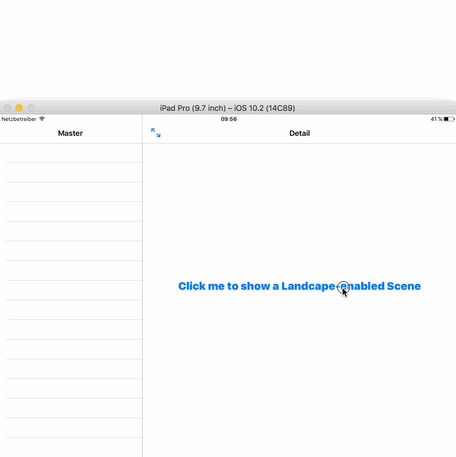

# Portrait scene in a Landscape app

This sample app shows how to display one scene (e.g. as a `ModalViewController`) in your landscape only app. It is based on a lighter version of the `Master/Detail` Starter Code in Xcode 8.2.1, where I even removed the Master and DetailVC, so they are simpley `UIViewController` instances.

## Screencast

## How does it work?

###Step 0 — It's important to note that the app has **only _Landscape_ in its Info.plist**.

###Step 1 — Then you need to implement this in your AppDelegate:

    func application(_ application: UIApplication, 
					 supportedInterfaceOrientationsFor window: UIWindow?) -> UIInterfaceOrientationMask 
	{
        if let vc = window?.rootViewController?.presentedViewController, 
		   !vc.isBeingDismissed && vc is ModalNavigationController {
            return .all
        }
        return application.supportedInterfaceOrientations(for: window)
    }

Each time a View Controller is shown, `application:supportedInterfaceOrientationsFor:` will be called. This is the trick.

See how you return only `all` for one kind of ViewController. This is your business logic. 

###Step 2 — It's also very important that your `ModalNavigationController` implements

    override var shouldAutorotate: Bool { get {
        return true
    } }
	
    open override var supportedInterfaceOrientations: UIInterfaceOrientationMask {
        return .all
    }

Those 2 methods will allow it to rotate. That's it, no step 3.

# HUGE Thanks!

To [@_dklein](https://twitter/_dklein) for helping me about this during the last [Cocoaheads Cologne](https://www.meetup.com/CocoaHeads-Cologne/). Thanks to [@mkalmes](https://twitter/mkalmes) for organizing it on that day where we actually spoke about Swift 3 Migrations ;)
